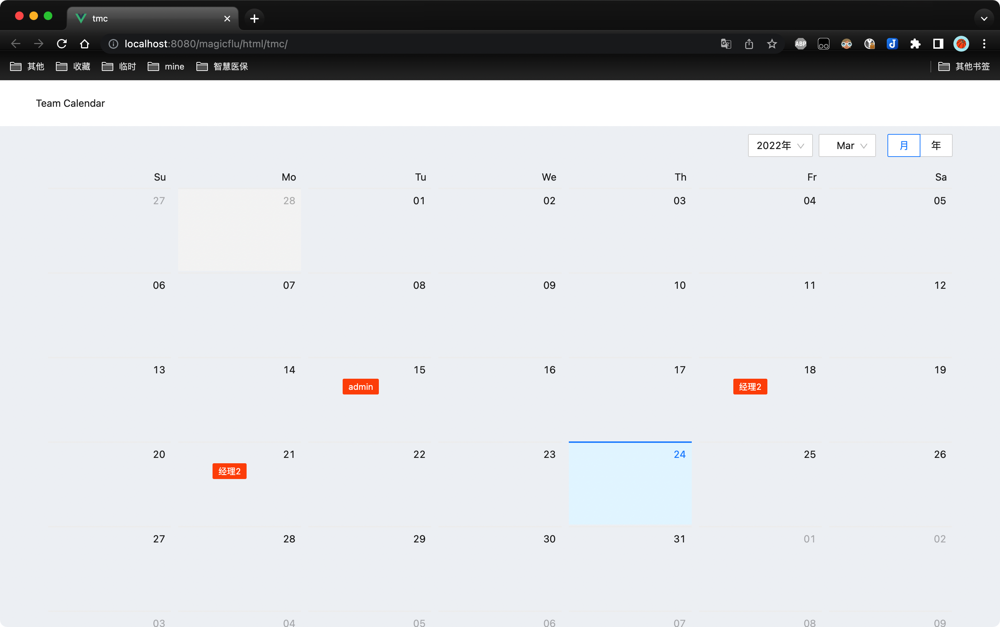

# Demo : vue3 + ant design

## intro

vue3+ant descign UI 实现的任务日程展示Demo

## func

- [x] and design引入
- [x] 日历展示
- [x] dayjs日期格式化
- [x] axios接口请求
- [x] vue打包配置

## preview




## Project setup

```
npm install
```

### Compiles and hot-reloads for development
```
npm run serve
```

### Compiles and minifies for production
```
npm run build
```

### Lints and fixes files
```
npm run lint
```

### Customize configuration
See [Configuration Reference](https://cli.vuejs.org/config/).
